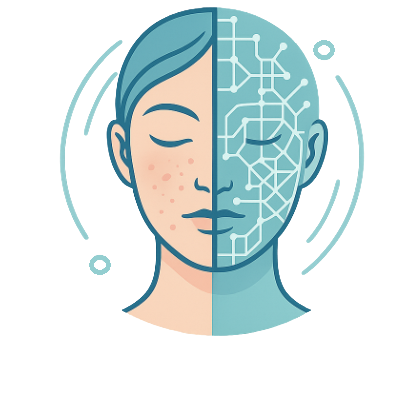
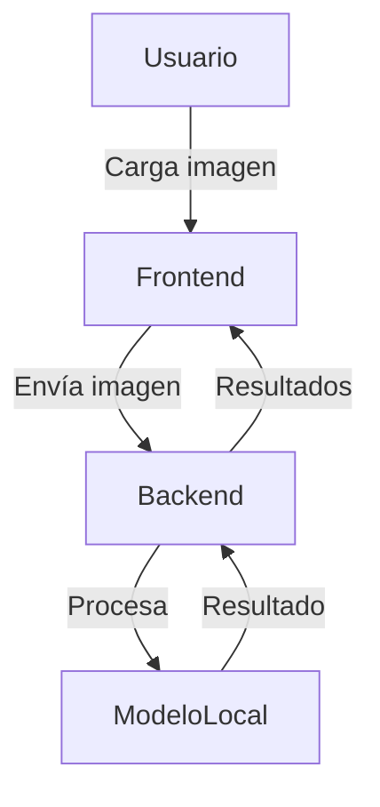

[](LICENSE)

# PielSana IA

## Cuidando tu piel con inteligencia artificial

<div align="center">
  
</div>

La piel es el órgano más grande de nuestro cuerpo y su salud es fundamental para nuestro bienestar físico y emocional. Sin embargo, muchas personas no tienen acceso fácil a un dermatólogo o a herramientas confiables para evaluar el estado de su piel.
**PielSana IA** nace con la misión de acercar la tecnología de inteligencia artificial a la vida cotidiana, permitiendo que cualquier persona pueda analizar el estado de su piel de manera rápida, privada y sencilla, desde cualquier lugar.

Nuestra plataforma ayuda a detectar y monitorear condiciones cutáneas frecuentes como el acné, la rosácea, las manchas solares y atípicas, la urticaria y las quemaduras. Así, buscamos empoderar a los usuarios para que tomen decisiones informadas sobre su salud y, si es necesario, consulten a un profesional con mayor información.

---

## ¿Cómo funciona PielSana IA?

1. **Sube una foto de tu rostro o zona de interés** a través de una interfaz web simple y segura.
2. **La imagen es analizada por un sistema de inteligencia artificial** que extrae información relevante sobre tu piel usando modelos locales.
3. **Recibes un informe inmediato** sobre posibles condiciones cutáneas detectadas, que puedes usar como referencia para tu autocuidado o para consultar con un especialista.

> **Privacidad:** Tus imágenes se procesan de forma temporal y se eliminan tras el análisis. No almacenamos datos personales.

---

## Estructura del Monorepo

```
Integrador/
├── frontend/               ← React + Vite
│   ├── src/
│   ├── public/
│   ├── package.json
│   ├── vite.config.js
│   └── ...
├── backend/                ← FastAPI y modelos locales
│   ├── main.py
│   ├── requirements.txt
│   ├── config/
│   ├── controllers/
│   ├── models/
│   ├── services/
│   ├── templates/
│   ├── routes.py
│   └── modelos/           ← Aquí van los modelos preentrenados locales
├── README.md
└── .gitignore
```

---

## Casos de Uso

- Autoevaluación y monitoreo de condiciones cutáneas.
- Apoyo para la consulta dermatológica, llevando información objetiva al profesional.
- Seguimiento de la evolución de lesiones o tratamientos.
- Herramienta educativa para conocer más sobre la salud de la piel.

### Principales Condiciones Cutáneas Analizadas

- **Lunares:** Identificación y clasificación de diferentes tipos de lesiones pigmentadas.
- **Acné:** Identificación y clasificación de diferentes tipos de lesiones acneicas.
- **Rosácea:** Detección de enrojecimiento, pápulas y telangiectasias.
- **Manchas solares y lesiones atípicas:** Evaluación de hiperpigmentaciones y lesiones sospechosas.

---

## ¿Quién puede usarlo?

- Personas que desean cuidar su piel y detectar problemas a tiempo.
- Profesionales de la salud que buscan una herramienta de apoyo.
- Investigadores interesados en el análisis automatizado de imágenes dermatológicas.

---

## Tabla de Contenido

- [PielSana IA](#pielsana-ia)
  - [Cuidando tu piel con inteligencia artificial](#cuidando-tu-piel-con-inteligencia-artificial)
  - [¿Cómo funciona PielSana IA?](#cómo-funciona-pielsana-ia)
  - [Estructura del Monorepo](#estructura-del-monorepo)
  - [Casos de Uso](#casos-de-uso)
    - [Principales Condiciones Cutáneas Analizadas](#principales-condiciones-cutáneas-analizadas)
  - [¿Quién puede usarlo?](#quién-puede-usarlo)
  - [Tabla de Contenido](#tabla-de-contenido)
  - [Características Técnicas](#características-técnicas)
  - [Tabla de Tecnologías](#tabla-de-tecnologías)
  - [Diagrama de Arquitectura](#diagrama-de-arquitectura)
  - [Capturas de Pantalla / GIF de Uso](#capturas-de-pantalla--gif-de-uso)
  - [Instalación y Uso](#instalación-y-uso)
    - [Requisitos](#requisitos)
    - [Backend](#backend)
    - [Frontend](#frontend)
  - [Ejemplo de Request/Response de la API](#ejemplo-de-requestresponse-de-la-api)
  - [FAQ - Preguntas Frecuentes](#faq---preguntas-frecuentes)
  - [Reconocimientos y Créditos](#reconocimientos-y-créditos)
  - [Política de Privacidad](#política-de-privacidad)
  - [Contribución](#contribución)
  - [Licencia y Contacto](#licencia-y-contacto)
  - [Modelos Integrados](#modelos-integrados)
    - [Modelos locales](#modelos-locales)

---

## Características Técnicas

PielSana IA combina lo último en inteligencia artificial y desarrollo web para ofrecer una experiencia robusta y segura:

- **Frontend:** Interfaz web desarrollada en React/Vite, fácil de usar y accesible desde cualquier dispositivo.
- **Backend:** API en FastAPI que gestiona la recepción y análisis de imágenes.
- **Modelos de IA:** Utiliza un modelo local de análisis dermatológico (por ejemplo, entrenado sobre el dataset HAM10000). El sistema está preparado para integrar modelos adicionales en el futuro.
- **Privacidad:** Procesamiento temporal de imágenes, sin almacenamiento de datos personales.
- **Extensibilidad:** Arquitectura modular que permite agregar nuevos modelos y funcionalidades fácilmente.

## Tabla de Tecnologías

| Capa         | Tecnología                                 |
|--------------|--------------------------------------------|
| Frontend     | React, Vite, TypeScript, TailwindCSS       |
| Backend      | FastAPI, Python, TensorFlow, Keras         |
| Modelos      | Modelos locales (ej: lunares.keras, otros) |
| Infraestructura | Docker, GitHub Actions, .env            |

## Diagrama de Arquitectura



## Capturas de Pantalla / GIF de Uso

<!-- Agrega aquí imágenes o GIFs mostrando el flujo de uso -->
<!--  -->

---

## Instalación y Uso

### Requisitos

- Python 3.10+
- Node.js 18+ (para el frontend)
- Docker (opcional)

### Backend

```bash
cd backend
python3.10 -m venv venv
source venv/bin/activate
pip install --upgrade pip
pip install -r requirements.txt
python main.py
```
La API estará disponible en http://localhost:8080

### Frontend

```bash
cd frontend
npm install
npm run dev
```
La interfaz web estará disponible en http://localhost:5173

---

## Ejemplo de Request/Response de la API

**Request:**
```http
POST /skin/api/analyze
Content-Type: multipart/form-data

file: imagen.png
```

**Response:**
```json
{
  "prediccion": "Lúnar Común (Nevus)",
  "probabilidades": {
    "Lúnar Común (Nevus)": 0.85,
    "Melanoma": 0.10,
    "Queratosis Benigna": 0.05
  },
  "modelo": "modelo local"
}
```

---

## FAQ - Preguntas Frecuentes

**¿Se almacenan mis imágenes?**
No, las imágenes se procesan y eliminan tras el análisis.

**¿Puedo usar mis propios modelos?**
Sí, el sistema es modular y permite integrar nuevos modelos fácilmente.

**¿Qué limitaciones tiene el sistema?**
Actualmente, el modelo base solo clasifica imágenes según las condiciones soportadas. El roadmap incluye la integración de más clasificadores específicos.

---

## Reconocimientos y Créditos

- [FastAPI](https://fastapi.tiangolo.com/)
- [React](https://react.dev/)
- [Vite](https://vitejs.dev/)
- [TailwindCSS](https://tailwindcss.com/)
- [TensorFlow](https://www.tensorflow.org/)
- [Keras](https://keras.io/)

---

## Política de Privacidad

Este proyecto procesa imágenes de manera temporal y no almacena datos personales. Si se despliega públicamente, se recomienda agregar una política de privacidad detallada.

---

## Contribución

¿Te gustaría colaborar?
Haz un fork, crea tu rama, realiza tus cambios y abre un Pull Request. ¡Toda ayuda es bienvenida!

---

## Licencia y Contacto

Este proyecto está bajo licencia MIT.
Para consultas o colaboración, contacta a:
- Nombre: [Tu Nombre]
- Email: [tu.email@example.com]
- GitHub: [github.com/tu_usuario]

---

## Modelos Integrados

### Modelos locales
- Puedes integrar cualquier modelo local de análisis dermatológico (por ejemplo, lunares.keras entrenado sobre HAM10000, u otros modelos propios o de terceros).
- El sistema es modular y permite agregar nuevos modelos fácilmente.
- **Próximamente:** Se sumarán modelos específicos para la detección de rosácea y acné, ampliando el alcance de la plataforma.
- **Ejemplo de predicciones del modelo lunares.keras:**
  - Queratosis Actínica
  - Carcinoma Basocelular
  - Queratosis Benigna
  - Dermatofibroma
  - Melanoma
  - Lúnar Común (Nevus)
  - Lesión Vascular